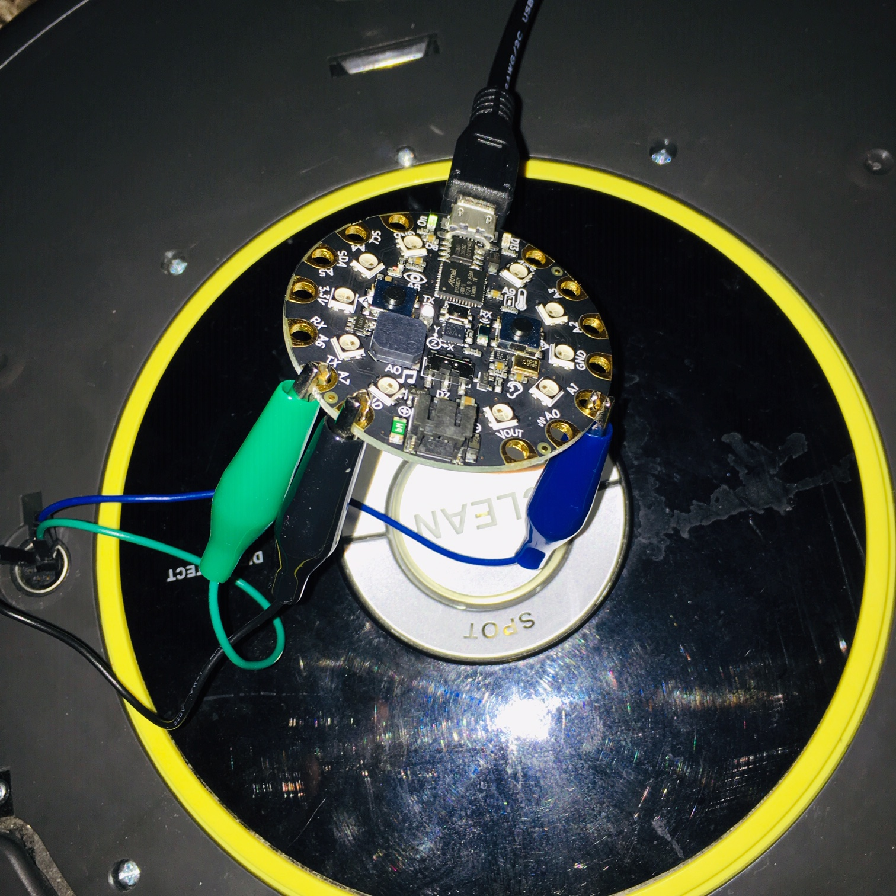
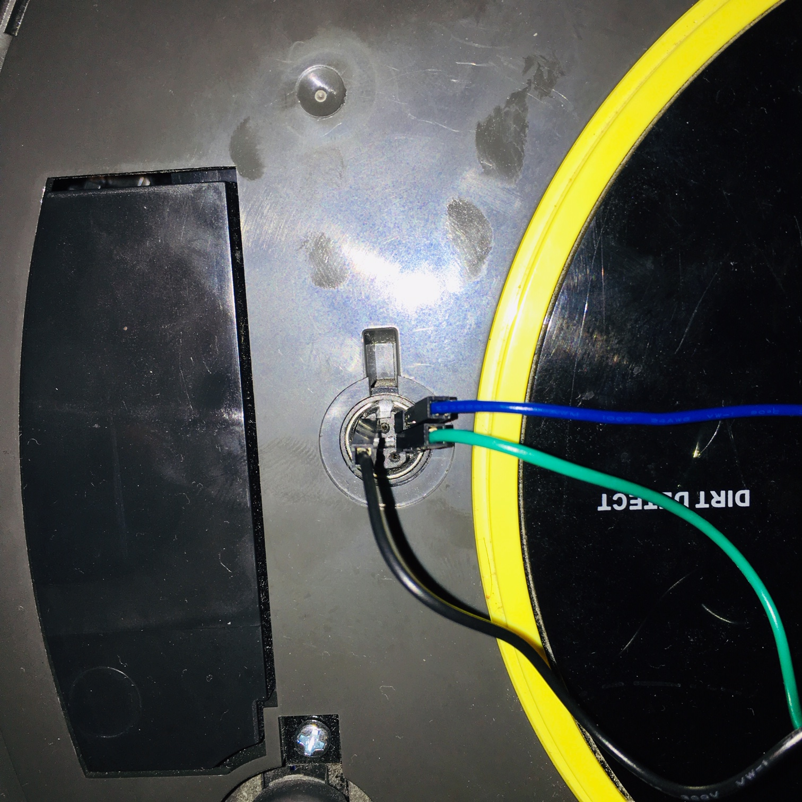

# Overview

This project contains the code and images for setting up an Adafruit Circuit Playground Express to interact with a Roomba 614. 

# Setup

Currently the Circuit Playground has the following connections:

- A1 -> Pin 5 - connected to BRC
- A7 -> Pin 3 - op code input
- GND -> Pin 7

# Progress

Currently I am working to get the baud rate set correctly and to translate the command to start the roomba in safe mode. 

Once I've done this I plan to add additional helper functions to correctly pad the bytes sent for different opcodes and to translate data received back from the sensors.

# References

[Roomba Open Interface Documentation](https://www.irobotweb.com/-/media/MainSite/PDFs/About/STEM/Create/iRobot_Roomba_600_Open_Interface_Spec.pdf?la=en)

[Circuit Playground Express Pinout](https://cdn-learn.adafruit.com/assets/assets/000/047/156/original/circuit_playground_Adafruit_Circuit_Playground_Express_Pinout.png?1507829017)

# Connections

